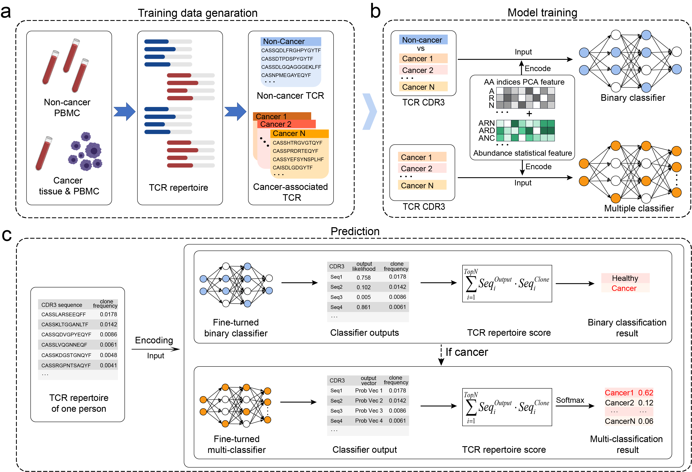

# iCanTCR
A deep learning framework for early cancer detection using T cell receptor repertoire in peripheral blood.
<p float="left">
  
</p>

### Installation

From Source:

```
 git clone https://github.com/JiangBioLab/iCanTCR.git
 cd iCanTCR
 pip install -r requirements.txt
```

### Quick Start
 Using the examples to perform iCanTCR. The first column is the amino acid sequence of CDR3, the second column is the cloning fraction,Each sample contains the sequences with the highest cloning abundance.
   
```
 python -u iCanTCR_run.py --I examples --O output --D cpu
```

### Web
 The iCanTCR program is also provided at the online webserver(http://jianglab.org.cn/iCanTCR)

### Contact
 Feel free to submit an issue or contact us at cyd_charrick@163.com for problems about the package.

