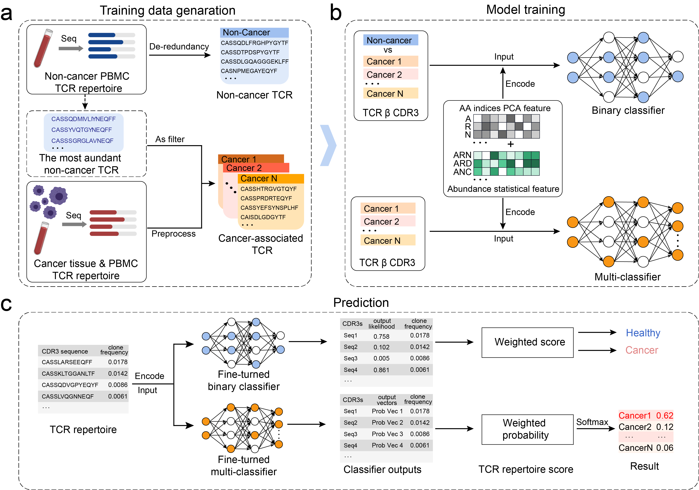

# iCanTCR
A deep learning framework for early cancer detection using T cell receptor repertoire in peripheral blood.
In brief, the framework contains two deep learning classifiers, including a binary classification module 
and a multi-category classification module, and their corresponding cancer scoring strategies. 
<p float="left">
  
</p>

### Installation

From Source:

```
 git clone https://github.com/JiangBioLab/iCanTCR.git
 cd iCanTCR
```
Running the iCanTCR requires python3.6, numpy version 1.19.2, torch version 1.6.0, torchvision version 0.7.0, 
pandas version 1.1.2 and scikit-learn version 0.24.2 to be installed. If they are not installed on your environment, 
please run the command:

```
 pip install -r requirements.txt
```

### Quick Start
 Using the examples to perform iCanTCR. 
 The examples folder contains 3 files. In each file, the first column is the amino acid sequence 
 of CDR3, the second column is the cloning fraction,Each sample contains the sequences with the highest 
 cloning abundance. Now, you can choose one of the following commands based on whether you want to use GPU
 or not, and input it in the terminal.

   
```
 python --I examples --O output --D cpu     # cpu only
 python --I examples --O output --D gpu     # if gpu is available
```

 If you want to perform binary classification tasks only, please run the following command.
   
```
 python --I examples --O output --D cpu --T binary  # cpu only
 python --I examples --O output --D gpu --T binary  # if gpu is available
```

Similarly, for multi-classification tasks only.

```
 python --I examples --O output --D cpu --T multi  # cpu only
 python --I examples --O output --D gpu --T multi  # if gpu is available
```

After running the command, an output file under the output folder will be created, which contains 
name of the input folder and the corresponding prediction result.

### Web
 The iCanTCR program is also provided at the online webserver(http://jianglab.org.cn/iCanTCR).

### Model Training
 You can train the model using the provided training data with the following command.
   
```
 python bina_training.py # if gpu is available you can add "--D gpu" in the end of this command
 python multi_training.py # if gpu is available you can add "--D gpu" in the end of this command
```

The dataset is first randomly divided into training data and testing data. Then, the training data 
is further divided into a training set and a validation set for model optimization.


### Contact
 Feel free to submit an issue or contact us at cyd_charrick@163.com for problems about the tool.

